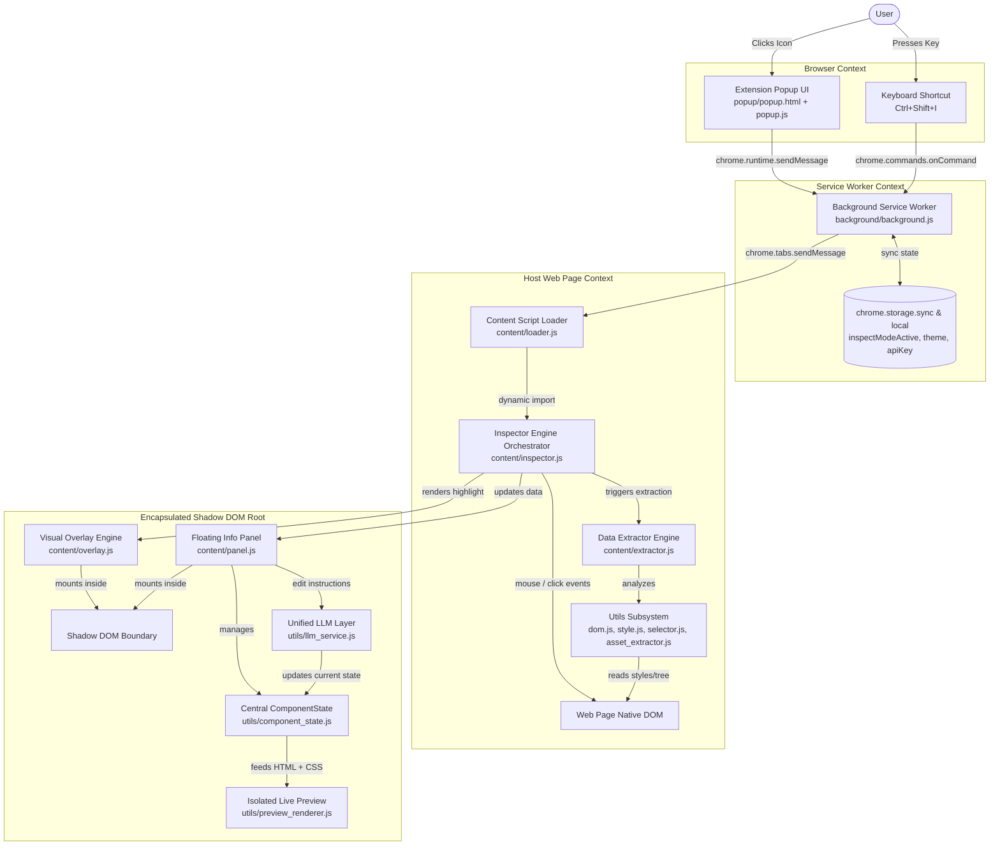

# 05 - System Architecture

## Overview
**Qursor++** follows a multi-tier Chrome Extension Manifest V3 architecture. The architecture separates the background service worker, extension popup UI, content script module orchestrator, and an isolated Shadow DOM presentation container backed by an authoritative `ComponentState` model and centralized `llm_service`.

---

## High-Level System Architecture Diagram

---

## Architecture Component Layers

### 1. Control & Trigger Layer
- **Popup UI (`popup/`)**: User interface displaying inspect mode status pill, enable/disable toggle button, appearance switcher (Light, Dark, System), keyboard shortcuts, and feature badges.
- **Commands API (`chrome.commands`)**: Global shortcut listener (`Ctrl+Shift+I`) handled by background worker.

### 2. State & Messaging Layer (`background/background.js`)
- **Central Coordinator**: Maintains application active state (`inspectModeActive`) inside `chrome.storage.local`.
- **Tab Message Dispatcher**: Relays toggle messages and theme updates between Popup UI and active target tab.
- **Injection Safeguard**: Dynamically executes `content/loader.js` via `chrome.scripting.executeScript` if target tab has not loaded content scripts.

### 3. Execution & Analytical Layer (`content/`)
- **Loader (`content/loader.js`)**: Entry content script loaded into web pages; dynamically imports `content/inspector.js` as an ES Module.
- **Engine (`content/inspector.js`)**: Coordinates capture-phase mouse listeners, element hover detection via `document.elementFromPoint`, click interception, keyboard cancellation (`ESC`), and theme change propagation.
- **Extractor (`content/extractor.js`)**: Aggregates properties from helper utilities (`utils/dom.js`, `utils/style.js`, `utils/selector.js`) into a unified JSON telemetry payload.

### 4. Encapsulated Presentation & Component Layer (`Shadow DOM`)
- **Shadow Host (`<website-inspector-root>`)**: Custom element injected into webpage root containing an open Shadow DOM tree to isolate styles.
- **Authoritative Component State (`utils/component_state.js`)**: Single source of truth managing original telemetry, active HTML & CSS, active zoom, active format, and LLM editing state.
- **Live Preview Renderer (`utils/preview_renderer.js`)**: Rebuilds an isolated iframe srcdoc on HTML, CSS, theme, or zoom changes with canvas theme isolation (`#000000` / `#FFFFFF`).
- **LLM Communication Layer (`utils/llm_service.js`)**: Handles provider autodetection, timeout handling, masked storage, and structured JSON parsing for editing and React generation.
- **Floating Panel (`content/panel.js`)**: 9-tab resizable inspector window with drag-and-drop support, format switching, and clipboard export buttons.
