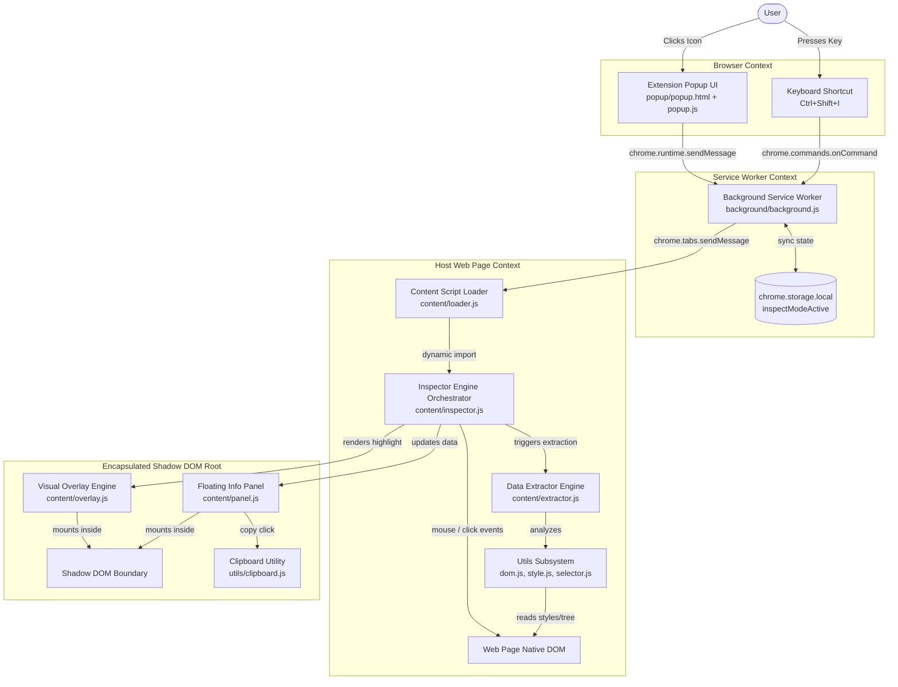

# 05 - System Architecture

## Overview
**Qursor++** follows a multi-tier Chrome Extension Manifest V3 architecture. The architecture separates the background service worker, extension popup UI, content script module orchestrator, and an isolated Shadow DOM presentation container.

---

## High-Level System Architecture Diagram

---

## Architecture Component Layers

### 1. Control & Trigger Layer
- **Popup UI (`popup/`)**: User interface displaying inspect mode status pill, toggle button, keyboard shortcuts, and version info.
- **Commands API (`chrome.commands`)**: Global shortcut listener (`Ctrl+Shift+I`) handled by background worker.

### 2. State & Messaging Layer (`background/background.js`)
- **Central Coordinator**: Maintains application active state (`inspectModeActive`) inside `chrome.storage.local`.
- **Tab Message Dispatcher**: Relays toggle messages between Popup UI and active target tab.
- **Injection Safeguard**: Dynamically executes `content/loader.js` via `chrome.scripting.executeScript` if target tab has not loaded content scripts.

### 3. Execution & Analytical Layer (`content/`)
- **Loader (`content/loader.js`)**: Entry content script loaded into web pages; dynamically imports `content/inspector.js` as ES Module.
- **Engine (`content/inspector.js`)**: Coordinates capture-phase mouse listeners, element hover detection via `document.elementFromPoint`, click interception, and keyboard cancellation (`ESC`).
- **Extractor (`content/extractor.js`)**: Aggregates properties from helper utilities (`utils/dom.js`, `utils/style.js`, `utils/selector.js`) into a unified DevTools JSON payload.

### 4. Encapsulated Presentation Layer (`Shadow DOM`)
- **Shadow Host (`<website-inspector-root>`)**: Custom element injected into webpage root containing an open Shadow DOM tree.
- **Overlay Engine (`content/overlay.js`)**: Highlighting bounding boxes and dimension tooltips positioned via `requestAnimationFrame`.
- **Panel Engine (`content/panel.js`)**: 11-tab glassmorphic inspector window with drag-and-drop support, tab switching, custom scrollbars, and clipboard export buttons.
